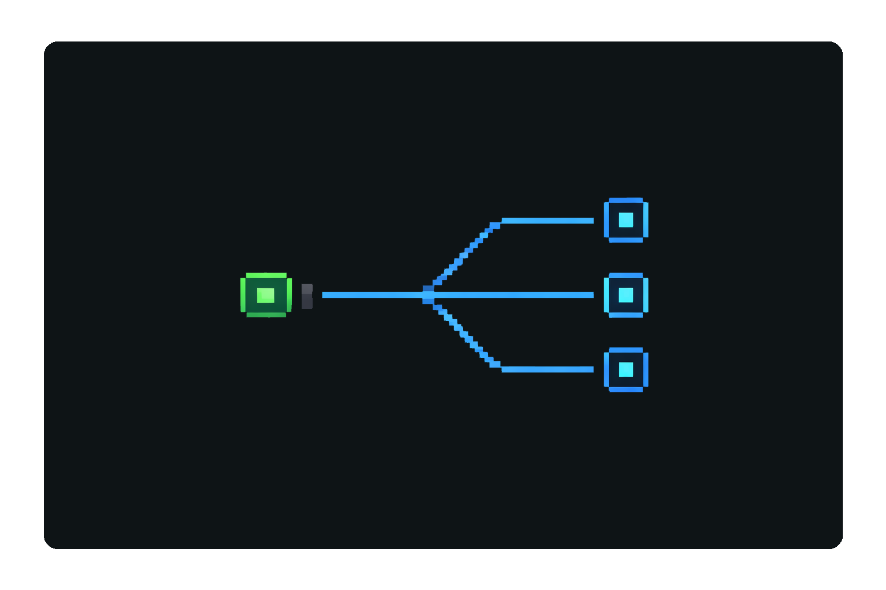

<p align="center">
  <a href="https://github.com/Oranda-IO/Conduit/stargazers"></a>&nbsp;
  &nbsp;
  &nbsp;
</p>

<p align="center">
  
</p>

<h1 align="center">Conduit</h1>

<p align="center">
  <strong>Automatic Port Forwarding for Docker Containers</strong>
  <br/>
  Use a single exposed port to quickly access any service running on your container.  Automatic port detection, port forwarding, and app name aliasing with a terminal and browser interface.
</p>

---

`conduit` watches local listening TCP ports and forwards HTTP requests by path:

- Incoming: `http://<host>:<public_port>/<internal_port>/<path...>`
- Forwarded to: `http://127.0.0.1:<internal_port>/<path...>`

Example:

- `http://myserver.com:9000/3000/api/users` -> `http://127.0.0.1:3000/api/users`

## Why Conduit

- Auto-discovery: watches local listening ports so only running services are routable.
- Single-port access: expose one port (for example `9000`) and reach many apps through it.
- Stable aliases: map ports to friendly names so URLs stay consistent across restarts.
- CLI + HTTP parity for state management: manage aliases and inspect running services from either interface.
- Built-in UI + API for browser and automation workflows.

## Route Modes

### Port route

- Incoming: `http://<host>:<public_port>/<internal_port>/<path...>`
- Forwarded to: `http://127.0.0.1:<internal_port>/<path...>`

Example:

- `http://myserver.com:9000/3000/api/users` -> `http://127.0.0.1:3000/api/users`

### Named route

Define a mapping in settings:

```json
{
  "apps": {
    "myapp1": 3000,
    "myapp2": 5173
  }
}
```

Then:

- `http://myserver.com:9000/myapp1/api/users` -> `http://127.0.0.1:3000/api/users`
- `http://myserver.com:9000/myapp2/` -> `http://127.0.0.1:5173/`

Conduit only proxies if the target port is currently listening.

### Host route

If `myapp` is mapped in settings and domain name is `conduit.local`:

- `http://myapp.conduit.local:9000/` -> `http://127.0.0.1:3000/`
- `http://myapp.conduit.local:9000/api/ping` -> `http://127.0.0.1:3000/api/ping`

This uses the request `Host` header instead of a path prefix.

## Install

1. Install Go (1.22+).
2. Build:

```bash
go build -o conduit .
```

## Run

```bash
./conduit -public-host 0.0.0.0 -public-port 9000
```

With one open/public port, examples look like:

- `http://<host>:9000/3000/` for direct port routing
- `http://<host>:9000/api/` for alias routing
- `http://api.conduit.local:9000/` for host-header routing

Useful flags:

- `-public-host` bind host (default `0.0.0.0`)
- `-public-port` bind port (default `9000`)
- `-target-host` upstream host (default `127.0.0.1`)
- `-poll-interval` rescan interval (default `2s`)
- `-settings-file` settings path (default `~/.conduit/settings.json`)
- `-domain-name` host-route suffix (default `conduit.local`)
- `-no-http` run without starting the HTTP server
- `-no-ui` alias for `-no-http`
- `-json` JSON output for CLI commands

## Terminal Interface

Conduit supports CLI commands against the same state used by HTTP endpoints:

```bash
conduit ports
conduit apps list
conduit apps set api 3000
conduit apps delete api
conduit health
```

Use `-json` for machine-readable output:

```bash
conduit -json apps list
conduit -json ports
```

## Settings File

Default location:

- `~/.conduit/settings.json`

Format:

```json
{
  "apps": {
    "api": 3000,
    "web": 5173
  }
}
```

Rules:

- Names are normalized to lowercase.
- Allowed characters: `a-z`, `0-9`, `.`, `_`, `-`
- Max name length: 63 chars.
- Port must be `1-65535`.

## Dashboard UI

Open:

- `http://<host>:<public_port>/ui`

The dashboard shows:

- Current name-to-port mappings
- Which mapped ports are running
- Running ports that do not yet have names
- Quick links for named route and numeric route
- Add/update/remove mapping form

## API

### `GET /health`

Health check.

Response:

```json
{"status":"ok"}
```

### `GET /ports`

Returns currently discovered listening local ports.

Response example:

```json
{
  "ports": [22, 3000, 5432],
  "count": 3,
  "updated_at": "2026-02-27T03:45:00Z"
}
```

### `GET /apps`

Returns configured app mappings plus running state and quick route paths.

Response example:

```json
{
  "apps": [
    {
      "name": "api",
      "port": 3000,
      "running": true,
      "named_path": "/api/",
      "port_path": "/3000/",
      "named_url": "http://localhost:9000/api/",
      "port_url": "http://localhost:9000/3000/"
    }
  ],
  "unmapped_running_ports": [5432],
  "settings_file": "/home/node/.conduit/settings.json",
  "updated_at": "2026-02-27T03:45:00Z"
}
```

### `POST /apps`

Create/update/delete app mapping.

JSON body examples:

Set mapping:

```json
{"action":"set","name":"api","port":3000}
```

Delete mapping:

```json
{"action":"delete","name":"api"}
```

### Proxy route `/<internal_port>/<path...>`

Conduit validates `internal_port` is listening, then proxies the request.

### Proxy route `/<app_name>/<path...>`

Conduit resolves `app_name` from settings, validates mapped port is listening, then proxies the request.

## HTTP Interface

When `conduit` runs normally, it starts one HTTP server that provides:

- Proxy routes (`/<port>/...`, `/<app>/...`, host-header mode)
- API endpoints (`/health`, `/ports`, `/apps`)
- Dashboard UI (`/ui`)

Run with `-no-http` (or `-no-ui`) to disable the HTTP server and use CLI-only workflows.

## Testing

```bash
go test ./...
```

## Notes

- HTTP reverse proxy behavior preserves query params, request body, and standard headers/cookies (except normal hop-by-hop header stripping).
- Linux-oriented port discovery via `/proc/net/tcp` and `/proc/net/tcp6`.
- In containers, publish/forward Conduit’s single public port (for example `9000:9000`).
